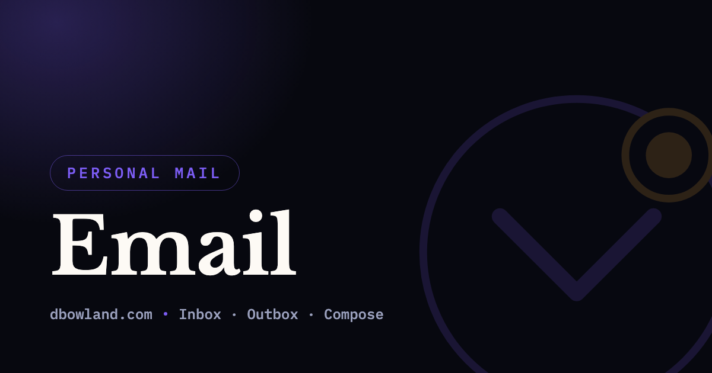

# Emails UI

[](https://email.dbowland.com/)

Next.js and Amplify implementation of emails-email-api. Example: <https://email.dbowland.com/>

## Static Site

### Prerequisites

1. [Node](https://nodejs.org/en/) 24.x (see `engines` in `package.json`)
1. [NPM](https://www.npmjs.com/)

### Local Development

The Next.js development server automatically re-renders in the browser when the source code changes. Start the local development server with:

```bash
npm run start
```

Alternatively, run a production build and serve that static content with:

```bash
npm run serve
```

Then view the server at <http://localhost:3000/>

### Unit Tests

[Jest](https://jestjs.io/) tests are run automatically on commit and push. If the test coverage threshold is not met, the push will fail. See `jest.config.js` for coverage threshold.

Manually run tests with:

```bash
npm run test
```

### Prettier / Linter

Both [Prettier](https://prettier.io/) and [ESLint](https://eslint.org/) are executed on commit. Manually prettify and lint code with:

```bash
npm run lint
```

### Deploying to Production

This project automatically deploys to production when a merge to `master` is made via a pull request.

## Deploy Script

In extreme cases, the UI can be deployed with:

```bash
npm run deploy
```

The `developer` role and [AWS SAM CLI](https://aws.amazon.com/serverless/sam/) are required to deploy this project.

### Testing the Workflow

Use [act](https://github.com/nektos/act) to test the GitHub workflow. Install it with:

```bash
brew install act
```

The workflow needs several secrets: `GIT_EMAIL`, `AWS_ACCESS_KEY_ID`, `AWS_SECRET_ACCESS_KEY`, `AWS_ACCOUNT_ID`, and `AWS_REGION`. Pass each one through from your local environment with:

```bash
act push -s GIT_EMAIL -s AWS_ACCESS_KEY_ID -s AWS_SECRET_ACCESS_KEY -s AWS_ACCOUNT_ID -s AWS_REGION
```

## Additional Documentation

### Additional Next.js Documentation

- [Documentation](https://nextjs.org/docs)

- [Pages Router](https://nextjs.org/docs/pages)

- [Static Exports](https://nextjs.org/docs/pages/building-your-application/deploying/static-exports)

### Additional Deploy Documentation

- [AWS SAM CLI](https://docs.aws.amazon.com/serverless-application-model/latest/developerguide/what-is-sam.html)

- [aws s3 sync](https://docs.aws.amazon.com/cli/latest/reference/s3/sync.html)

### Additional Workflow Documentation

- [Workflow Syntax for GitHub Actions](https://docs.github.com/en/actions/reference/workflow-syntax-for-github-actions)

- [actions/checkout](https://github.com/actions/checkout)

- [actions/setup-node](https://github.com/actions/setup-node)

- [actions/setup-python](https://github.com/actions/setup-python)

- [aws-actions/setup-sam](https://github.com/aws-actions/setup-sam)

- [aws-actions/configure-aws-credentials](https://github.com/aws-actions/configure-aws-credentials)
